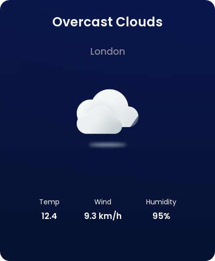

# Zemo

   

Zemo is a web service with the function of generating an image with the prediction of a particular locale. Uses as a source of data meteriologicos to api maintained by [openweathermap.org](https://openweathermap.org/)

 
 

 
 

### Technologies used

This project is base on:

-   **NodeJs**
-   **[Openweathermap](https://openweathermap.org/) API**
-   **[node-html-to-image](https://github.com/frinyvonnick/node-html-to-image)**

### Setup

Clone this repo to your desktop and run `npm install` to install all the dependencies.

### Usage

After you clone this repo to your desktop, go to its root directory and run `npm install` to install its dependencies.

Once the dependencies are installed, you can run `npm dev` to start the application in dev mode. List of scripts available:
-   `npm dev` - Run api in dev mode
-   `npm start` - Run without api nodemon
